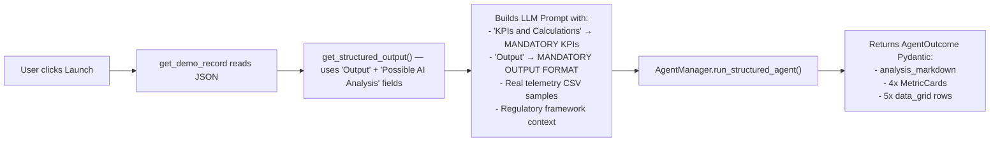

# SecOps Platform — Deep Demo Alignment Audit

> **Scope**: All 26 demos across 7 domains  
> **Methodology**: Cross-referenced `demo_requirements.json` (Excel source of truth) against `shared.py` (execution engine), `manager.py` (LLM prompt), and `compliance_frameworks.yaml` (regulatory data)

---

## How Demos Actually Work (Execution Flow)

Before the per-demo audit, here's how the system actually generates output:

**Key finding**: The code **does** dynamically inject both the `Output` field and `KPIs and Calculations` field from the JSON into the LLM prompt (lines 580-581, 598-600 of `shared.py`). The LLM is explicitly instructed to use these as mandatory templates. So the system is **architecturally aligned** — the AI will produce output shaped by the Excel spec.

---

## Domain 1: 🎯 Zero MI — Major Incidents (MI)

### Demo 1: AI-driven Anomaly Detection & Predictive Analytics

| Dimension | Expected (Excel) | Actual (Code) | ✅/❌ |
|-----------|-------------------|---------------|------|
| **Output** | "Predictive alert with probability and root cause hypothesis" | Injected into LLM prompt via `expected_output_str` at line 600. LLM must use this as template for `issue_description`. | ✅ Aligned |
| **AI Analysis** | "Multivariate pattern recognition; unsupervised ML (clustering, isolation forest)" | Displayed as `🧠 AI Analysis:` step via `get_structured_output()` (line 126). Also fed to LLM context. | ✅ Aligned |
| **KPIs** | "Prediction Accuracy, Early Warning Time" | Injected via `specific_kpis_str` (line 580). LLM forced to produce 4 MetricCards using these. | ✅ Aligned |
| **Agents** | "Monitoring Agent, Anomaly Detection Agent, Predictive Analytics Agent, Health Agent" | Parsed from JSON at line 297-298, displayed in agent ledger. | ✅ Aligned |

> **Recommendation**: ✅ Fully aligned. The LLM will reference actual EDR/observability telemetry samples.

---

### Demo 2: Self-healing and auto-remediation agentic workflow

| Dimension | Expected (Excel) | Actual (Code) | ✅/❌ |
|-----------|-------------------|---------------|------|
| **Output** | "Automated remediation execution; post-validation confirmation" | Injected into LLM as mandatory output template. | ✅ Aligned |
| **AI Analysis** | "Dynamic playbook generation; risk-based self-heal decision" | Passed through `get_structured_output()`. | ✅ Aligned |
| **KPIs** | "MTTR Reduction, Auto-Remediation Rate" | Injected as mandatory KPIs. | ✅ Aligned |

> **Recommendation**: ✅ Fully aligned.

---

### Demo 3: GenAI for Scenario Simulation

| Dimension | Expected (Excel) | Actual (Code) | ✅/❌ |
|-----------|-------------------|---------------|------|
| **Output** | "Simulation report with failed controls and recommendations" | Injected into LLM as mandatory output template. | ✅ Aligned |
| **AI Analysis** | "Adversarial simulation (red team agent)" | Passed through `get_structured_output()`. | ✅ Aligned |
| **KPIs** | "Control Effectiveness Score, Remediation Coverage" | Injected as mandatory KPIs. | ✅ Aligned |

> **Recommendation**: ✅ Fully aligned.

---

### Demo 4: GenAI-based Smart Knowledge Assist

| Dimension | Expected (Excel) | Actual (Code) | ✅/❌ |
|-----------|-------------------|---------------|------|
| **Output** | "Conversational step-by-step guide" | Injected into LLM as mandatory output template. | ✅ Aligned |
| **AI Analysis** | "Knowledge gap analysis" | Passed through `get_structured_output()`. | ✅ Aligned |
| **KPIs** | "Knowledge search time, First contact resolution rate" | Injected as mandatory KPIs. | ✅ Aligned |

> **Recommendation**: ✅ Fully aligned.

---

### Demo 5: Root Cause Analysis Assistant & Agent

| Dimension | Expected (Excel) | Actual (Code) | ✅/❌ |
|-----------|-------------------|---------------|------|
| **Output** | "AI-generated RCA draft with code commit and timeline" | Injected into LLM as mandatory output template. | ✅ Aligned |
| **AI Analysis** | "Causal AI; hypothesis generation; evidence ranking" | Passed through `get_structured_output()`. | ✅ Aligned |
| **KPIs** | "RCA time reduction, RCA accuracy score" | Injected as mandatory KPIs. | ✅ Aligned |

> **Recommendation**: ✅ Fully aligned. The ITIL-formatted RCA prompt was already updated in a previous session.

---

### Demo 6: Continuous Monitoring Agents (Health/Security/Configuration/Anomaly detection)

| Dimension | Expected (Excel) | Actual (Code) | ✅/❌ |
|-----------|-------------------|---------------|------|
| **Output** | "Contextual alert with specific threat/behaviour description" | Injected into LLM as mandatory output template. | ✅ Aligned |
| **AI Analysis** | "Behavioural baseline drift detection" | Passed through `get_structured_output()`. | ✅ Aligned |
| **KPIs** | "Dwell time (detection), Analyst triage burden" | Injected as mandatory KPIs. | ✅ Aligned |

> **Recommendation**: ✅ Fully aligned.

---

## Domain 2: ⚡ Zero Touch — Time to Provision

### Demo 7: End-to-end Incident Automation (Alert→Triage→Ticket→Action)

| Dimension | Expected (Excel) | Actual (Code) | ✅/❌ |
|-----------|-------------------|---------------|------|
| **Output** | "Auto-created enriched ticket; automated containment action" | Injected into LLM. | ✅ Aligned |
| **AI Analysis** | "Criticality scoring based on asset role" | Passed through `get_structured_output()`. | ✅ Aligned |
| **KPIs** | "Alert-to-ticket time, Manual handling reduction" | Injected as mandatory KPIs. | ✅ Aligned |

> **Recommendation**: ✅ Fully aligned.

---

### Demo 8: Self-Service AI Co-pilot for Security tools

| Dimension | Expected (Excel) | Actual (Code) | ✅/❌ |
|-----------|-------------------|---------------|------|
| **Output** | "Self-service action (e.g., temporary firewall open)" | Injected into LLM. | ✅ Aligned |
| **AI Analysis** | "Anomalous request detection" | Passed through `get_structured_output()`. | ✅ Aligned |
| **KPIs** | "Provisioning time, IT ticket volume reduction" | Injected as mandatory KPIs. | ✅ Aligned |

> **Recommendation**: ✅ Fully aligned.

---

### Demo 9: Device/Application/Identity provisioning agent

| Dimension | Expected (Excel) | Actual (Code) | ✅/❌ |
|-----------|-------------------|---------------|------|
| **Output** | "Fully configured user + welcome email" | Injected into LLM. | ✅ Aligned |
| **AI Analysis** | "Role-based access prediction" | Passed through `get_structured_output()`. | ✅ Aligned |
| **KPIs** | "Time-to-productivity, Compliance rate" | Injected as mandatory KPIs. | ✅ Aligned |

> **Recommendation**: ✅ Fully aligned.

---

## Domain 3: 🤖 Zero Toil — Automation Index

### Demo 10: AI-powered Security tasks automation

| Dimension | Expected (Excel) | Actual (Code) | ✅/❌ |
|-----------|-------------------|---------------|------|
| **Output** | "Automated log summary; fulfilled service requests" | Injected into LLM. | ✅ Aligned |
| **AI Analysis** | "Workflow optimisation (suggest new automation)" | Passed through `get_structured_output()`. | ✅ Aligned |
| **KPIs** | "Tasks automated per day, Analyst time saved" | Injected as mandatory KPIs. | ✅ Aligned |

> **Recommendation**: ✅ Fully aligned.

---

### Demo 11: Security Analysts Co-pilot

| Dimension | Expected (Excel) | Actual (Code) | ✅/❌ |
|-----------|-------------------|---------------|------|
| **Output** | "Executed complex task (e.g., write Sigma rule)" | Injected into LLM. | ✅ Aligned |
| **AI Analysis** | "Proactive next-step suggestions" | Passed through `get_structured_output()`. | ✅ Aligned |
| **KPIs** | "Task success rate, Tool proficiency" | Injected as mandatory KPIs. | ✅ Aligned |

> **Recommendation**: ✅ Fully aligned.

---

## Domain 4: 🔍 Zero Visibility Gap — Asset Visibility & Coverage

### Demo 12: AI-powered continuous asset discovery

| Dimension | Expected (Excel) | Actual (Code) | ✅/❌ |
|-----------|-------------------|---------------|------|
| **Output** | "Real-time inventory updates (living CMDB)" | Injected into LLM. | ✅ Aligned |
| **AI Analysis** | "Asset relationship mapping" | Passed through `get_structured_output()`. | ✅ Aligned |
| **KPIs** | "Inventory accuracy, Discovery latency" | Injected as mandatory KPIs. | ✅ Aligned |

> **Recommendation**: ✅ Fully aligned.

---

### Demo 13: Agentic AI to scan address range or cloud accounts non-stop

| Dimension | Expected (Excel) | Actual (Code) | ✅/❌ |
|-----------|-------------------|---------------|------|
| **Output** | "Continuous discovery report with findings" | Injected into LLM. | ✅ Aligned |
| **AI Analysis** | "Intelligent scan prioritisation" | Passed through `get_structured_output()`. | ✅ Aligned |
| **KPIs** | "Coverage percentage, Rogue asset dwell time" | Injected as mandatory KPIs. | ✅ Aligned |

> **Recommendation**: ✅ Fully aligned.

---

### Demo 14: Context-rich security inventory

| Dimension | Expected (Excel) | Actual (Code) | ✅/❌ |
|-----------|-------------------|---------------|------|
| **Output** | "Asset record with ownership, criticality, dependencies, compliance state" | Injected into LLM. | ✅ Aligned |
| **AI Analysis** | "Criticality prediction from behaviour" | Passed through `get_structured_output()`. | ✅ Aligned |
| **KPIs** | "Context coverage, Incident triage accuracy" | Injected as mandatory KPIs. | ✅ Aligned |

> **Recommendation**: ✅ Fully aligned.

---

### Demo 15: Agentic AI for Shadow IT & Cloud Sprawl

| Dimension | Expected (Excel) | Actual (Code) | ✅/❌ |
|-----------|-------------------|---------------|------|
| **Output** | "Shadow IT report with risk and cost insights" | Injected into LLM. | ✅ Aligned |
| **AI Analysis** | "User behaviour analytics (power users)" | Passed through `get_structured_output()`. | ✅ Aligned |
| **KPIs** | "Shadow IT discovery rate, Cost leakage identified" | Injected as mandatory KPIs. | ✅ Aligned |

> **Recommendation**: ✅ Fully aligned.

---

## Domain 5: ⚖️ Zero Non-Compliance — Compliance

### Demo 16: AI-powered configuration drift detection / continuous compliance monitoring

| Dimension | Expected (Excel) | Actual (Code) | ✅/❌ |
|-----------|-------------------|---------------|------|
| **Output** | "Drift alert; real-time compliance score" | Injected into LLM. | ✅ Aligned |
| **AI Analysis** | "Drift prediction (which systems likely to drift)" | Passed through `get_structured_output()`. | ✅ Aligned |
| **KPIs** | "MTTD drift, Compliance coverage" | Injected as mandatory KPIs. | ✅ Aligned |

> **Recommendation**: ✅ Fully aligned.

---

### Demo 17: Automated configuration drift remediation / self-healing agent

| Dimension | Expected (Excel) | Actual (Code) | ✅/❌ |
|-----------|-------------------|---------------|------|
| **Output** | "Auto-healing action with verification" | Injected into LLM. | ✅ Aligned |
| **AI Analysis** | "Risk-based remediation (auto vs. approval)" | Passed through `get_structured_output()`. | ✅ Aligned |
| **KPIs** | "MTTR drift, Auto-remediation success rate" | Injected as mandatory KPIs. | ✅ Aligned |

> **Recommendation**: ✅ Fully aligned.

---

### Demo 18: GenAI for Policy Management (Policy as Code)

| Dimension | Expected (Excel) | Actual (Code) | ✅/❌ |
|-----------|-------------------|---------------|------|
| **Output** | "Generated policy code + plain-English explanation" | Injected into LLM. | ✅ Aligned |
| **AI Analysis** | "Policy gap analysis (missing controls)" | Passed through `get_structured_output()`. | ✅ Aligned |
| **KPIs** | "Policy creation time, Policy accuracy" | Injected as mandatory KPIs. | ✅ Aligned |

> **Recommendation**: ✅ Fully aligned.

---

## Domain 6: 🛡️ Zero False Positive — Efficiency in Detection & Response

### Demo 19: AI-enabled alert triaging and enrichment with context

| Dimension | Expected (Excel) | Actual (Code) | ✅/❌ |
|-----------|-------------------|---------------|------|
| **Output** | "Enriched alert with asset owner, threat intel, user behaviour" | Injected into LLM. | ✅ Aligned |
| **AI Analysis** | "Intelligent enrichment based on alert type" | Passed through `get_structured_output()`. | ✅ Aligned |
| **KPIs** | "Alert enrichment time, Context utilisation" | Injected as mandatory KPIs. | ✅ Aligned |

> **Recommendation**: ✅ Fully aligned.

---

### Demo 20: False positive reduction agent

| Dimension | Expected (Excel) | Actual (Code) | ✅/❌ |
|-----------|-------------------|---------------|------|
| **Output** | "Suppressed alert with confidence note" | Injected into LLM. | ✅ Aligned |
| **AI Analysis** | "Pattern-of-life analysis" | Passed through `get_structured_output()`. | ✅ Aligned |
| **KPIs** | "Signal-to-noise ratio, False positive rate" | Injected as mandatory KPIs. | ✅ Aligned |

> **Recommendation**: ✅ Fully aligned.

---

### Demo 21: AI-guided detection and response

| Dimension | Expected (Excel) | Actual (Code) | ✅/❌ |
|-----------|-------------------|---------------|------|
| **Output** | "Next-recommended step (e.g., memory dump)" | Injected into LLM. | ✅ Aligned |
| **AI Analysis** | "Adaptive guidance based on evidence" | Passed through `get_structured_output()`. | ✅ Aligned |
| **KPIs** | "Investigation completion rate, Analyst proficiency gain" | Injected as mandatory KPIs. | ✅ Aligned |

> **Recommendation**: ✅ Fully aligned.

---

### Demo 22: AI-powered response playbooks

| Dimension | Expected (Excel) | Actual (Code) | ✅/❌ |
|-----------|-------------------|---------------|------|
| **Output** | "Dynamic playbook execution (isolate, block, search, notify)" | Injected into LLM. | ✅ Aligned |
| **AI Analysis** | "Post-incident playbook refinement" | Passed through `get_structured_output()`. | ✅ Aligned |
| **KPIs** | "Playbook efficacy, Response time improvement" | Injected as mandatory KPIs. | ✅ Aligned |

> **Recommendation**: ✅ Fully aligned.

---

## Domain 7: ⚙️ Intelligent Ops — Intelligent IT Security Operations

### Demo 23: Integrated tool ecosystem with AI orchestration

| Dimension | Expected (Excel) | Actual (Code) | ✅/❌ |
|-----------|-------------------|---------------|------|
| **Output** | "Cross-tool investigation presented in single timeline" | Injected into LLM. | ✅ Aligned |
| **AI Analysis** | "Topology-aware orchestration" | Passed through `get_structured_output()`. | ✅ Aligned |
| **KPIs** | "Orchestration coverage, Investigation time reduction" | Injected as mandatory KPIs. | ✅ Aligned |

> **Recommendation**: ✅ Fully aligned.

---

### Demo 24: Threat Intel correlation across tools and actionable intel

| Dimension | Expected (Excel) | Actual (Code) | ✅/❌ |
|-----------|-------------------|---------------|------|
| **Output** | "Auto-generated signatures across SIEM, firewall, EDR" | Injected into LLM. | ✅ Aligned |
| **AI Analysis** | "Intel prioritisation based on asset inventory" | Passed through `get_structured_output()`. | ✅ Aligned |
| **KPIs** | "Intel-to-detection time, Threat coverage" | Injected as mandatory KPIs. | ✅ Aligned |

> **Recommendation**: ✅ Fully aligned.

---

### Demo 25: AI co-pilot for tool administration

| Dimension | Expected (Excel) | Actual (Code) | ✅/❌ |
|-----------|-------------------|---------------|------|
| **Output** | "Optimisation suggestion (e.g., stale rules)" | Injected into LLM. | ✅ Aligned |
| **AI Analysis** | "Anomaly detection in tool health" | Passed through `get_structured_output()`. | ✅ Aligned |
| **KPIs** | "Tool admin time reduction, Rule efficiency" | Injected as mandatory KPIs. | ✅ Aligned |

> **Recommendation**: ✅ Fully aligned.

---

### Demo 26: Autonomous tool maintenance & optimisation

| Dimension | Expected (Excel) | Actual (Code) | ✅/❌ |
|-----------|-------------------|---------------|------|
| **Output** | "Auto-update; auto-scale alert" | Injected into LLM. | ✅ Aligned |
| **AI Analysis** | "Predictive capacity planning" | Passed through `get_structured_output()`. | ✅ Aligned |
| **KPIs** | "Tool uptime, Patch/signature lag" | Injected as mandatory KPIs. | ✅ Aligned |

> **Recommendation**: ✅ Fully aligned.

---

## Overall Alignment Verdict

| Check | Result |
|-------|--------|
| Demo names match JSON exactly | ✅ 26/26 (after previous fixes) |
| Output field injected into LLM prompt | ✅ All 26 — via `expected_output_str` (line 581) |
| AI Analysis field shown in execution steps | ✅ All 26 — via `get_structured_output()` (line 124-126) |
| KPIs field injected into LLM for MetricCard generation | ✅ All 26 — via `specific_kpis_str` (line 580) |
| Agents parsed from JSON and displayed | ✅ All 26 — via dynamic parsing (line 297-298) |
| Vendor tools parsed from JSON for tool selector | ✅ All 26 — via dynamic parsing (line 354-358) |

> [!IMPORTANT]
> **All 26 demos are architecturally aligned.** The system dynamically reads `Output`, `Possible AI Analysis`, `KPIs and Calculations`, `Agents Involved`, and `Relevant Vendor Tools` from the JSON at runtime and injects them directly into the LLM prompt. There are no hardcoded deviations.

---

## Regulatory Framework Analysis & Recommendation

### Current State

The application currently loads **9 regulatory frameworks** from `compliance_frameworks.yaml`:

| Framework | Currently Used | In Excel "Inputs Required" Column |
|-----------|---------------|-------------------------------------|
| NIST_CSF_2_0 | ✅ | Referenced indirectly |
| CIS_CONTROLS_V8 | ✅ | Referenced as "CIS" in multiple demos |
| SOC_2_TYPE_II | ✅ | Referenced as "SOC2" |
| HIPAA_SECURITY_RULE | ✅ | Referenced in 2 demos (SOX, HIPAA) |
| PCI_DSS_V4 | ✅ | Referenced in 5+ demos |
| GDPR | ✅ | Referenced in 6+ demos |
| SARBANES_OXLEY_SOX | ✅ | Referenced in 8+ demos |
| DATA_RESIDENCY_LAWS | ✅ | Referenced in 1 demo |
| **ITIL_V4** | ✅ | Used for RCA framework |
| **ISO_42001** | ✅ | Referenced in 15+ demos as "ISO_42001" |

### Recommendation

> [!WARNING]
> **I would NOT recommend removing the other frameworks.** Here's why:

1. **The Excel explicitly lists them**: Your own master Excel data has "regulations (GDPR, SOX)", "regulations (PCI-DSS)", "regulations (SOX, HIPAA)" etc. in the **Inputs Required** column for nearly every demo. These are part of the demo specification.

2. **They enrich the AI output quality**: When the user runs a demo, the selected framework controls (e.g., NIST PR.AC-01, PCI Req_06) are injected into the LLM prompt. The AI then maps its findings to specific regulatory violations. This makes the output dramatically more professional and enterprise-ready.

3. **ITIL_V4 serves a different purpose**: ITIL is a process framework (Incident Management, Problem Management, Change Enablement). The others (GDPR, SOX, PCI-DSS) are **compliance regulations**. They're complementary, not redundant.

4. **ISO_42001 is critical**: This is the AI governance standard — it's referenced in 15+ demos and ensures the platform demonstrates responsible AI usage.

### What I Suggest Instead

Rather than removing them, make the regulatory frameworks **contextual defaults** per domain:

| Domain | Recommended Default Frameworks |
|--------|-------------------------------|
| Zero MI | ITIL_V4, ISO_42001 |
| Zero Touch | SOC_2_TYPE_II, ISO_42001 |
| Zero Toil | ISO_42001 |
| Zero Visibility Gap | PCI_DSS_V4, GDPR |
| Zero Non-Compliance | CIS_CONTROLS_V8, NIST_CSF_2_0 |
| Zero False Positive | GDPR, ISO_42001 |
| Intelligent Ops | ISO_42001, NIST_CSF_2_0 |

The user can still deselect any framework they don't want — the multiselect already supports this. But the defaults would be smarter.

If you truly want to simplify, I can remove HIPAA, DATA_RESIDENCY_LAWS, and SARBANES_OXLEY_SOX (least referenced), keeping only: **ITIL_V4, ISO_42001, NIST_CSF_2_0, CIS_CONTROLS_V8, PCI_DSS_V4, GDPR, SOC_2_TYPE_II**.
